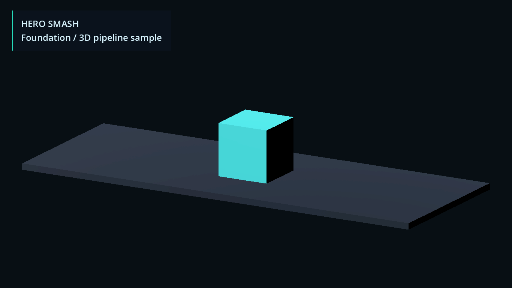
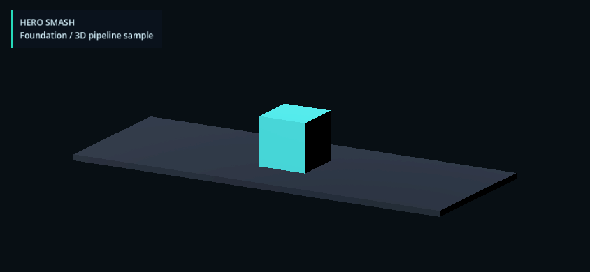

# v1.16 — Executed evidence

Validated implementation: `e0185b4bb038a5314490e553c9374d6e3437927e` on
`revival/v1.16-canonical-data`, descending from the required v1.15 tag/commit
`80c098b256f5855d4c5dfb9869135fd2bad6c709`. Date: 2026-09-08.

The fresh local clone `.work/qa-v116-release/` used the same branch, had no
`game/.godot` cache before validation, and was clean both before and after all
commands. It used existing Godot 4.7.2 and Python 3.12.0 in an isolated venv.
The final documentation/evidence commits do not change this implementation.

## Executed checks

`canonical.json`: **11/11 pass**, including clean-before/after, baseline ancestry
and tag, task branch, exact Godot version, reproducible generation/diff, Python
schema/source tests, fresh Godot import and both headless suites.

- Five Python tests include complete raw source/provenance comparison, all schemas,
  deterministic generation, unchanged committed bytes, source-mutation refusal and
  30 malformed-data subcases shared with Godot.
- Godot loader: **104 assertions**, no failures.
- Effect framework: **8,150 assertions**, no failures. Twelve base-text contracts,
  138 explicit unavailable-semantic rejections, eight seeds × 400 events repeated,
  known proc vectors and rejection sampling, actor-mirror symmetry, timer partition
  independence, ordering, threshold/min/max/cap boundaries and rollback.
- Standard Draft 2020-12 Python validation and the documented fail-closed Godot
  subset read the same schemas. No interactive editor was required.

`foundation.json`: **18/18 pass**, profile `local-foundation`, working tree clean.
This rechecks all 393 unchanged web blobs, all 1,152 archive paths/hashes, metadata
and alternate-source comparisons, references, 45 JS modules and 300 HTTP resources,
eight JS seeds × three rounds repeated, existing asset validators, Blender version,
GLB structure/provenance, arena dimensions/alpha, Godot import/boot/determinism and
actual Vulkan Mobile rendering at both resolutions.

The workflow YAML was parsed locally with existing PyYAML and its dependency and
canonical gate steps verified. No remote GitHub Actions run or Linux execution is
claimed. CI installs the pinned requirements only in its disposable runner.

## Commands in the fresh clone

Exact executable paths and complete output are in the JSON evidence. Equivalent
portable invocation with the already installed tools:

```powershell
<isolated-python> tools/validation/canonical.py --godot <existing-godot-4.7.2> --expected-branch revival/v1.16-canonical-data --require-clean --report <report-path>
<isolated-python> -X utf8 tools/validation/foundation.py --archive <read-only-archive> --godot <existing-godot-4.7.2> --blender <existing-blender-5.2-LTS> --pillow-python <existing-python-with-Pillow> --visual --report <report-path>
git status --porcelain
```

The final Git status output was empty. Source-lock checks use normalized UTF-8/LF
hashes; the separate foundation archive validator checks original byte hashes.

## Failed attempts and limits

`first_clean_attempt.json` preserves the actual failed clean-checkout gate at
`845f767`: all logic tests passed, but Godot rewrote `.glb.import` line endings.
The initial data change had replaced the existing foundation Git attributes.
`e507533` restored the import rule; final review `e0185b4` restored **every** v1.15
text/binary rule and retained only additive JSON attributes. A new clone then passed
both complete profiles. This was an introduced and fixed regression, not hidden
pre-existing debt.

An early cost-uniformity assertion also failed on actual source data: Epic ID071
costs 300. The validator now compares preserved costs with source, and a regression
assertion locks that exception. No card cost was changed.

The old JS `combat_readability_check.py` still fails its two stale identifier
searches exactly as at v1.15. The foundation gate explicitly verifies that known
failure remains unchanged; it does not claim the old script succeeds.

Skipped/not applicable: remote CI, Android/iOS packaging/signing/device tests,
physical phone performance/safe areas and final-character/VFX checks. SDK/export
templates remain missing. No UI/art production or full combat resolver changed.
All numbered card levels and global status/death semantics remain out of this
pilot profile, with explicit errors/pending damage intents instead of invented rules.

## Visual regression evidence

Both PNGs were inspected: the existing cyan animated cube/floor and foundation
label render within the viewport at 1366×768 and 844×390. This is the existing
pipeline fixture, not gameplay UI or a final arena/character.




